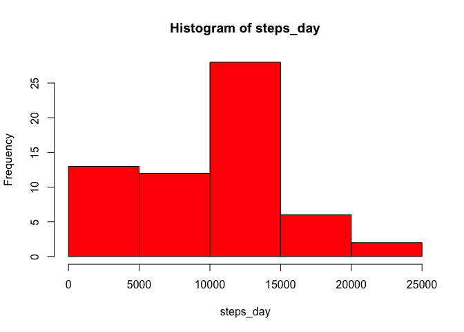
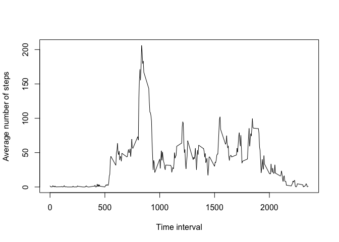
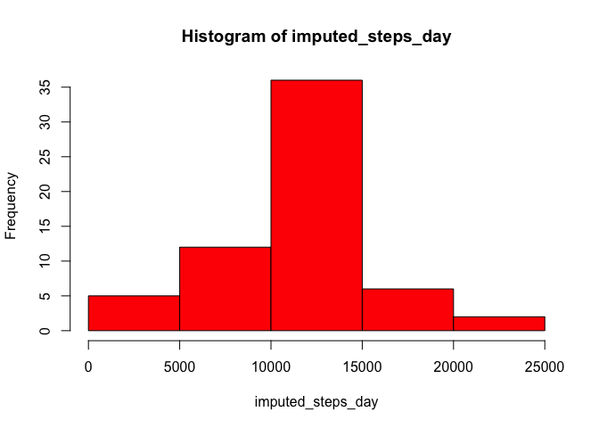
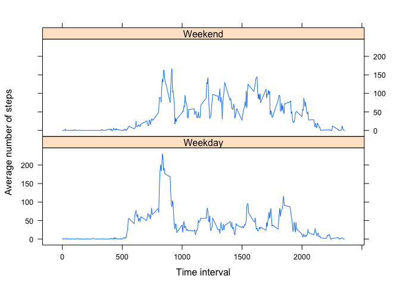

# Reproducible Research: Peer Assessment 1


## Loading and preprocessing the data


First of all set working directory in which we have the data, and load data into 
R.


```r
setwd("/Users/odrilarra/Documents/APUNTEAK/Coursera/5.Reproducible research/WEEK2/ASSIGNMENT/RepData_PeerAssessment1")
data <- unzip("activity.zip")
data <- read.csv(data)
```


Check the structure of the dataset:


```r
str(data)
```

```
## 'data.frame':	17568 obs. of  3 variables:
##  $ steps   : int  NA NA NA NA NA NA NA NA NA NA ...
##  $ date    : Factor w/ 61 levels "2012-10-01","2012-10-02",..: 1 1 1 1 1 1 1 1 1 1 ...
##  $ interval: int  0 5 10 15 20 25 30 35 40 45 ...
```


Format the variable date using as.Date().


```r
data$date <- as.Date(data$date,"%Y-%m-%d")
```


## What is mean total number of steps taken per day?


```r
steps_day <- tapply(data$steps, data$date, sum, na.rm=TRUE)
```


Histogram of the total number of steps taken each day:


```r
hist(steps_day,col="red")
```

<!-- -->


Compute the mean and the median of the total number of steps taken per day.

Mean

```r
mean(steps_day)
```

```
## [1] 9354.23
```

Median

```r
median(steps_day)
```

```
## [1] 10395
```


## What is the average daily activity pattern?


Calculate average number of steps taken at 5 minute intervals, averaged across 
all days. Plot average number of steps vs. time intervals.


```r
steps_inter <- tapply(data$steps, data$interval, mean, na.rm=TRUE)
plot(unique(data$interval), steps_inter, ylab="Average number of steps", 
     xlab="Time interval", type="l")
```

<!-- -->


5-minute interval containing the maximum number of steps, averaged across all
days.


```r
unique(data$interval)[which.max(steps_inter)]
```

```
## [1] 835
```


## Imputing missing values


Calculate the total number of missing values in the dataset:


```r
sum(is.na(data$steps))
```

```
## [1] 2304
```


Replace missing values by average number of steps across all days, for that time interval:


```r
data$steps[is.na(data$steps)] <- tapply(data$steps, data$interval, mean, na.rm=TRUE)
```


Make a histogram using the dataset without NA-s:


```r
imputed_steps_day <- tapply(data$steps, data$date, sum)
hist(imputed_steps_day,col="red")
```

<!-- -->

Many artificial 0 values were created by ignoring the missing values. Now the 
hitogram is more symetrical.

Compute the mean and the median of the total number of steps taken per day, using
the imputed dataset.

Mean

```r
mean(imputed_steps_day)
```

```
## [1] 10766.19
```

Median

```r
median(imputed_steps_day)
```

```
## [1] 10766.19
```

After imputing the NA-s, the median coincides with the mean.


## Are there differences in activity patterns between weekdays and weekends?


Identify days as weekdays and weekends:


```r
data$week.d <- as.factor(ifelse(weekdays(data$date)=="Saturday" | weekdays(data$date)=="Sunday", "Weekend", "Weekday"))
```


Panel plot for weekdays and weekends: average number of steps vs. time intervals.


```r
data_weekday <- subset(data, week.d=="Weekday")
data_weekend <- subset(data, week.d=="Weekend")
steps_inter_weekday <- tapply(data_weekday$steps, data_weekday$interval, mean)
data_weekday <- data.frame(steps=steps_inter_weekday,interval=unique(data_weekday$interval),week.d=rep("Weekday",length(steps_inter_weekday)))
steps_inter_weekend <- tapply(data_weekend$steps, data_weekend$interval, mean)
data_weekend <- data.frame(steps=steps_inter_weekend,interval=unique(data_weekday$interval),week.d=rep("Weekend",length(steps_inter_weekend)))
plot_data <- data.frame(rbind(data_weekday,data_weekend))
library(lattice)
xyplot(steps~interval|week.d,data=plot_data,layout=c(1,2),type="l",ylab="Average number of steps", 
     xlab="Time interval")
```

<!-- -->
